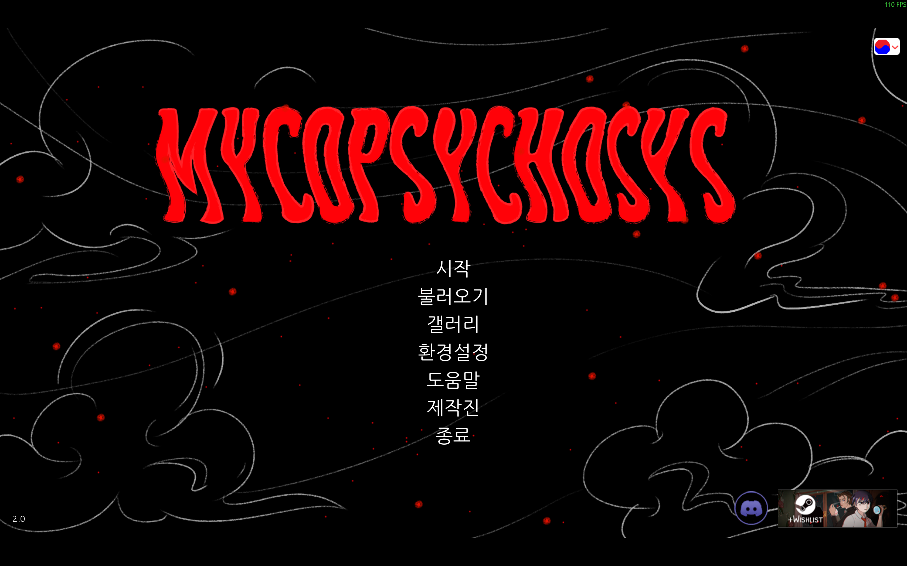
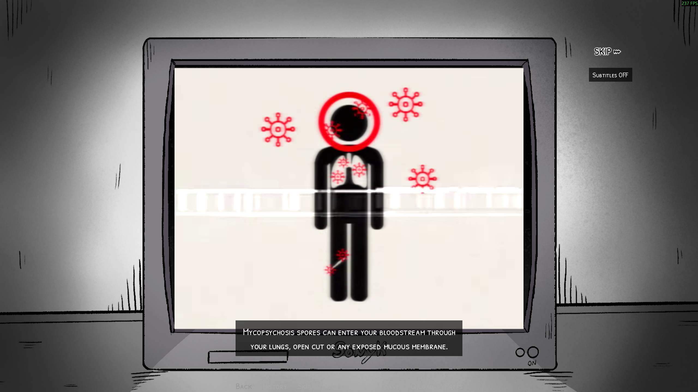

# Mycopsychosys Remastered - Unofficial Translation/Function Patch

Unofficial feature patch for Game 'Mycopsychosys: Remastered'. (+Korean Translation)
'Mycopsychosys: Remastered' 게임의 비공식 기능 및 한국어 번역 패치입니다.

For further instructions, please check 'README_eng.md' that linked below. (Including "How to Install")
설치방법 등 자세한 내용은 아래의 README Files 섹션의 언어별 README 파일을 참고해주세요. (README_kor.md 파일)

---

Original Game: [DeltaCatStudio](https://www.deltacatstudio.com/)

- [Mycopsychosys Remastered (Steam)](https://store.steampowered.com/app/3807550/Mycopsychosys_Remastered/)
- [Mycopsychosys Remastered (itch.io)](https://delta-cat-studio.itch.io/mycopsychosys)

Developer/Contributors (UnOfficial Patch): MuteJack

## Information / 정보

- Version Info / 버전 정보:

  - Game Title (게임 제목): Mycopsychosys Remastered
  - Game Version (게임 버전): Mycopsychosys v2.0 (2026.02.14 Update) or Later
  - Patch Version (패치 버전):  1.0.7 (2026.02.15)

---

## README Files / 언어별 README 파일

- [English- README_eng.md](README_eng.md)
- [한국어 - README_kor.md](README_kor.md)

---

## ScreenShots

### Title (Unoffical Korean Translation)

### Subtitle for Intro Video (Korean/English)

<table>
  <tr>
    <td></td>
    <td></td>
  </tr>
</table>

### ~~Translated/Offline Web Docs (Korean Only) # Deleted~~

<td></td>
