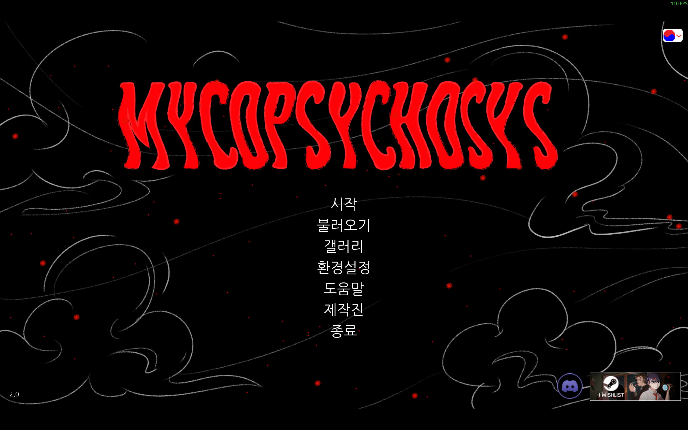
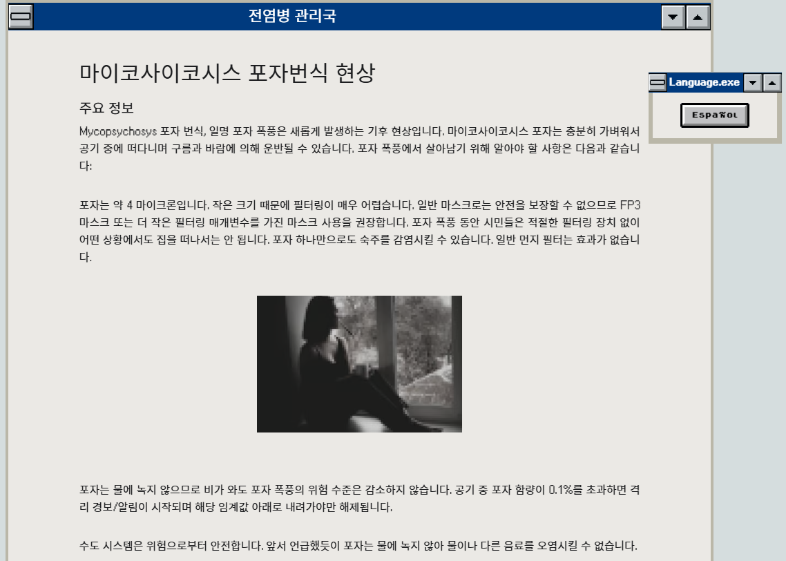
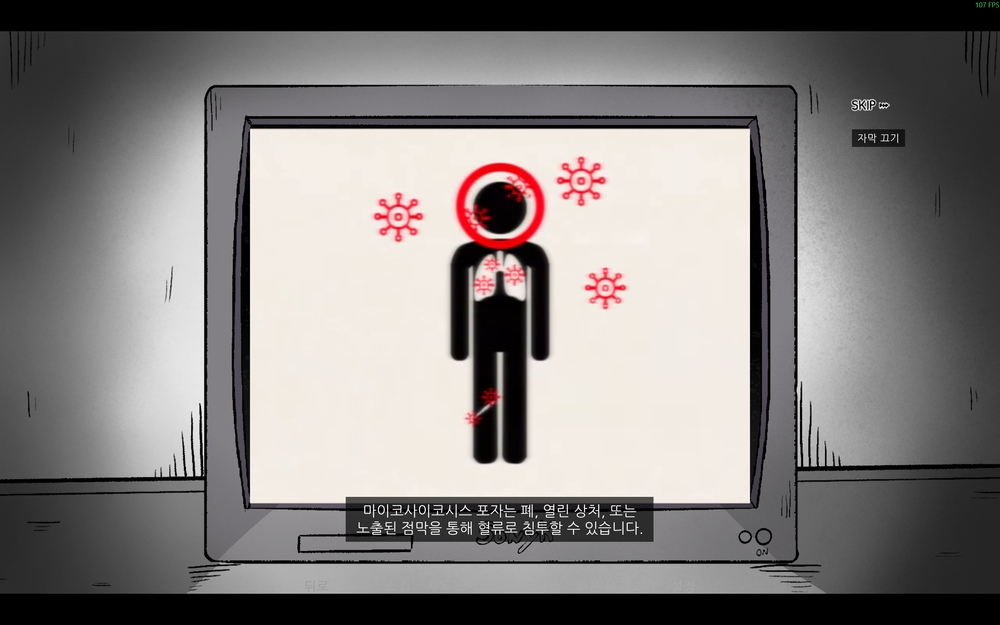

# Mycopsychosys Remastered - 비공식 기능/한국어 번역 패치

NOTE: If you want to read this as another language, check README_{lang}.md. (ex: README_eng.md)

Mycopsychosys Remastered의 비공식 기능/한국어 번역 패치입니다.
게임이 업데이트될 시, 적용이 불가할 수 있습니다.

## 0. Informations

### 0.1. Version Info

- 게임 이름: Mycopsychosys Remastered
- 게임 버전: Mycopsychosys v2.0 (2026.01.06 업데이트)
- 패치 버전: 1.0 (2026.01.31)

### 0.2. 지원

- O/S: Windows 10 or Later
- Game Platform: Steam (Itch.io에서 구매/다운로드 가능한 게임에 대해서는 테스트되지 않았습니다.)

## 1. 설치 방법

1. Steam에서 Mycopsychosys Remastered를 구매, 설치합니다.
2. Patcher 폴더를 게임 폴더 내에 복사합니다.
   1. 기본 경로: `C:\Program Files (x86)\Steam\steamapps\common\Mycopsychosys Remastered\`
   2. 기타 경로: `{드라이브 문자}:\SteamLibrary\steamapps\common\Mycopsychosys Remastered\`
3. git 홈페이지에서 Git for Windows/x64 Portable을 다운로드 받고, Patcher폴더 내의 GitPortable 폴더에 복사합니다.
   다운로드:  `https://git-scm.com/install/windows`
4. Patcher폴더의 apply_patch.bat을 실행합니다.
5. 게임 실행 후 추가된 언어/기능을 확인합니다.

## 2. 변경 사항

### 2.1. 비공식 번역 추가

#### 2.1.1 한국어 번역

- 전체 게임 텍스트 번역 (`game/tl/korean/`)
- 캐릭터 이름 번역
- UI/메뉴 번역
- 한글 지원 폰트(나눔고딕) 추가



#### 2.1.2 한국어 UI 버튼 이미지

- `game/images/Buttons/korean/` 에 위치
- Basement, Bathroom, Bedroom, FrontDoor, Hallway, Kitchen, LivingRoom, Loft, Window
- skip 버튼 (skip1, skip2)
- 현재 영어로 된 게임 내 원본 이미지를 사용 (추후 버튼 이미지에 대한 번역 지원과, 기존 버튼에 대한 기본 언어가 english가 아닌 catalan인 이유로 추가됨)

### ~~2.2 오프라인 웹사이트 기능 (현재 한국어 한정 - 삭제됨)~~

~~게임 내 `mycopsychosis.online` 웹사이트에 대한 번역본을 오프라인으로 볼 수 있도록 구현했습니다.~~

- ~~(`game/webpage/`)파일 추가 (영어, 스페인어)~~
- ~~비공식 번역(한국어) 버전 추가~~
- ~~Python 기반 로컬 HTTP 서버 (`game/webpage_host.py`) 추가 - 비디오 시킹, 자막 지원 (한국어 한정)~~
- ~~html파일에 대한 저작권 문제, 운영체제 및 Python 버전 종속성 문제, 로컬 호스팅에 대한 잠재적인 보안문제가 우려되어 삭제되었습니다.~~



### 2.3 인트로 비디오 자막 추가 (자막 파일 및 기능)

인게임 내에서 인트로 비디오에 자막을 표시합니다.

- 기본 자막 (영어,  `game/MYCOPSYCHOSIS.vtt`)
- 번역 자막 (`game/tl/{language}/MYCOPSYCHOSIS.vtt`)
- 현재 영어, 한국어 외의 다른 언어에 대한 번역은 없습니다. (기본 언어: 영어)
- 게임 내 preference에서 language를 직접 가져오므로, `./game/tl/{language}/`에 `MYCOPSYCHOSIS.vtt` 자막파일 추가 시 자동 적용됩니다. 단, 정상적으로 추가된 번역에 한해서 인식되며 그렇지 않을 경우 기본 자막(영어)로 표시될 수 있습니다.



### 2.4 버그 수정 (게임 자체 버그)

#### 2.4.1 원본 게임 버그 수정

- **EndOnna 엔딩 이미지 일부 표시 안됨**: Onna 캐릭터 이미지가 일부 전환되지 않는 문제 수정
- **Bedroom의 PC 선택 스크립트 번역 미적용 (한국어 번역 한정)**: PC선택에 대한 스크립트가 Ren'Py 번역 해시가 없어 원본 스크립트에 분기점 추가. 추후 추가 수정 예정

#### 2.4.2 크레딧 수정

- 프랑스어/러시아어 번역자 정보 줄 분리 (언어에 밑줄이 적용되지 않는 문제)
- 한국어 번역자(MuteJack) 정보 추가 (한국어 번역 한정, 다른 언어에 대한 패치 추가 시 비공식 번역 명시 권장)

### Note

위 버그 수정 사항은 게임 진행에 영향을 미치지 않는 매우 사소한 버그에 대한 비공식 Minor Fix이며, 이미 DeltaCat Studio에 제보되었습니다. 비공식 번역/패치 작업 중 우연히 발견하여 수정한 것을 해당 비공식 패치에 함께 포함한 것이며, 원본 게임의 품질을 지적하려는 의도는 없습니다.

### ~~2.5 추가 개발 도구 (삭제됨)~~

- ~~`check_apostrophe.py`: 번역 파일의 아포스트로피 불일치 자동 검출 도구, 게임 내 아포스트로피'가 straight(')와 curly(’)가 혼용되어있음.~~

## 3. 파일 구조

```
Patcher/
├── apply_patch.bat (패치 적용 파일)
├── unofficial_patch.dat
├── PortableGit/
|   └── PortableGit-2.52.0-64-bit.7z.exe (git 홈페이지에서 다운로드 필요)
├── README.md
├── README_kor.md
├── README_eng.md
└── README/
    └── {Image Files for README files}
```

## 4. 주의사항

- 해당 패치는 비공식이며, DeltaCat Studio와 관련이 없습니다.
- 게임 "Mycopsychosys Remastered의 모든 저작권은 DeltaCat Studio에 있습니다."
- 패치 파일에는 게임의 스크립트, 리소스 파일 원본이 포함되어 있지 않으며, 최소한의 수정 이력에 대한 데이터 파일과 이를 게임에 적용하기 위한 batch 스크립트 및 파일 구조만을 포함, 제공됩니다.
  - 개발용 레포지터리에는 게임의 원본 파일/스크립트가 다수 포함되어 있어, 저작권 보호를 위해 수정된 파일 대신 패치 파일만을 배포하는 방식을 채택하였습니다.
  - 위와 같은 이유로 개발용 레포지터리는 공개되지 않으며, 원본 레포지터리/소스코드에 대한 공개 요청(개인 연락 포함)은 받지 않습니다.
  - 본 패치 제작자는 DeltaCat Studio와 그들의 저작물을 존중하며, 원본 게임의 권리를 침해할 의도가 없음을 밝힙니다.
- 패치 적용 대상 버전은 **Mycopsychosys Remastered v2.0 (2026.01.26 Update)**입니다. 게임이 업데이트되었을 경우, 패치가 정상적으로 적용되지 않거나 예측 불가한 동작을 야기할 수 있습니다.
- 게임 오류 발생 시 game폴더 삭제, 게임 재설치 통해 원본 상태로 복구할 수 있습니다.
  - Steam 게임 특성상, game폴더를 삭제하지 않으면 수정사항은 재설치 과정에서 제거되지 않으므로 주의바랍니다.
- 본 패치는 어떠한 보증 없이 제공되며, 패치 사용으로 인해 발생하는 오류, 데이터 손상, 기타 모든 문제에 대해 제작자는 책임지지 않습니다.

## 5. Credits

원본 게임: [DeltaCatStudio](https://www.deltacatstudio.com/)

- [Mycopsychosys Remastered (Steam)](https://store.steampowered.com/app/3807550/Mycopsychosys_Remastered/)

- [Mycopsychosys Remastered (itch.io)](https://delta-cat-studio.itch.io/mycopsychosys)

비공식 패치 제작자: MuteJack
