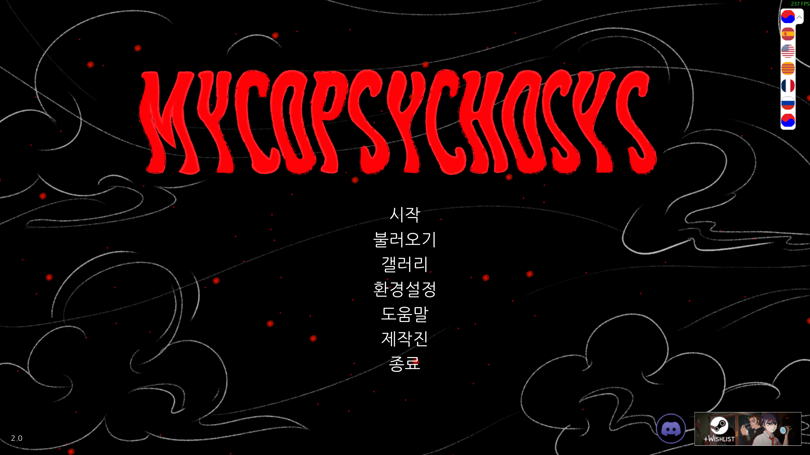
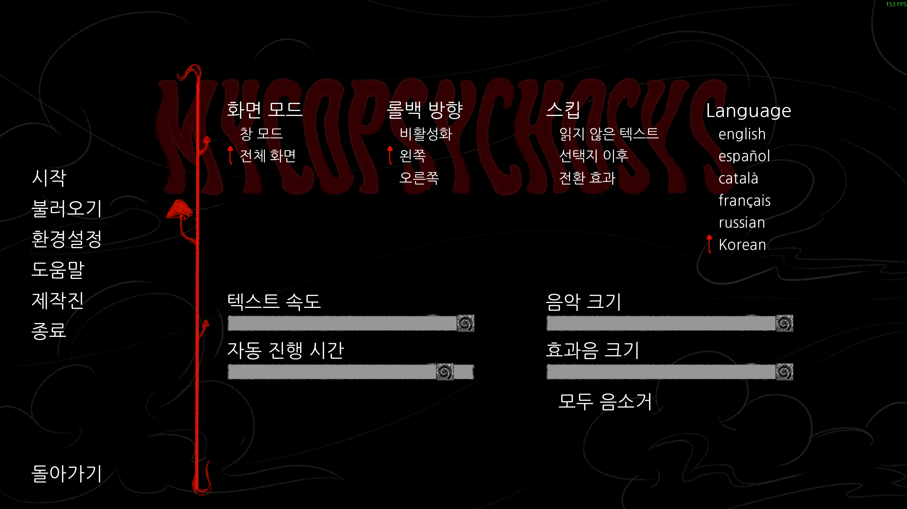
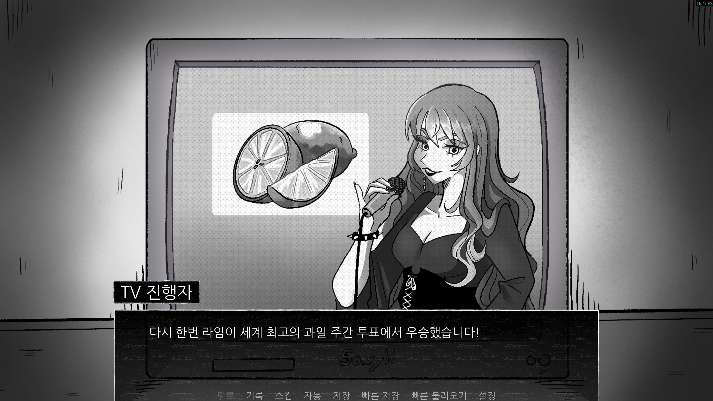
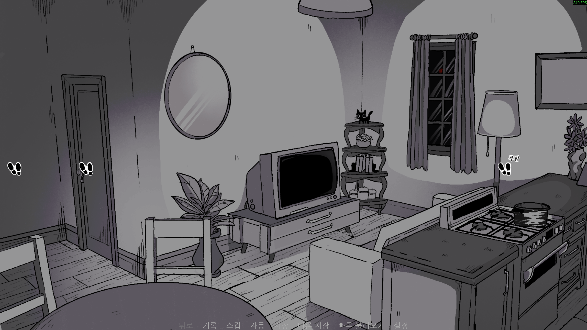
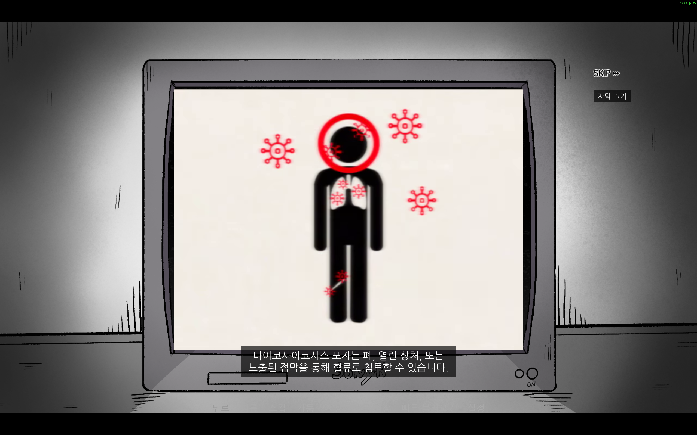
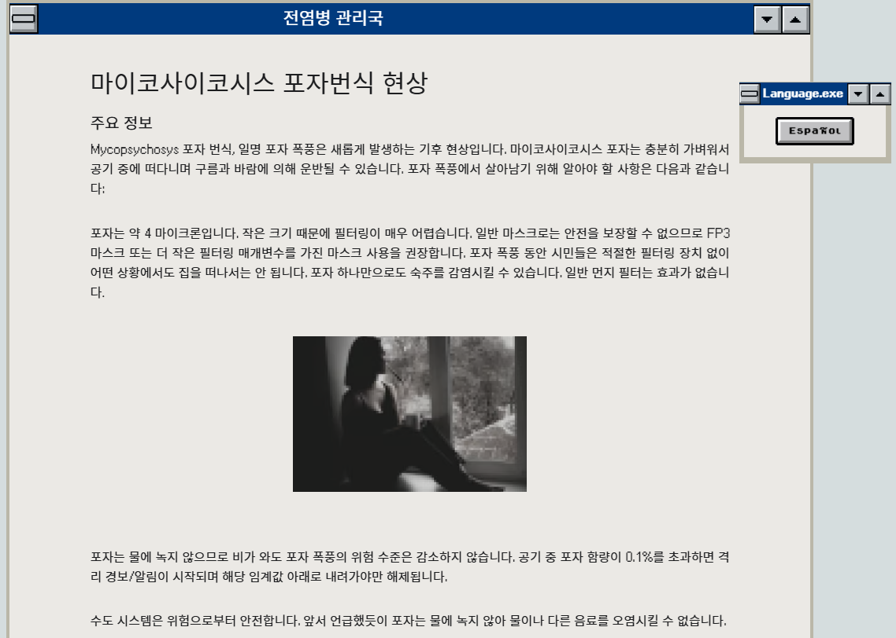

# Mycopsychosys Remastered - 비공식 기능/한국어 번역 패치

> NOTE: If you want to read this as English, check [README_eng.md](README_eng.md)

Mycopsychosys Remastered의 비공식 기능/한국어 번역 추가 패치입니다.
게임이 업데이트될 시, 적용이 불가할 수 있습니다.

한국어 번역 패치의 경우, 2026.02.14 업데이트 이후 게임에서 한국어를 정식 지원하므로 해당 패치에서 제거되었습니다.
번역 지원에 관심가져주신 게임 개발팀 DeltaCatStudio와 소속 개발자 i3q2에 감사의 말씀 올립니다.

---

## 0. Information

### 0.1. 버전 정보

- 게임 이름: Mycopsychosys Remastered
- 게임 버전: Mycopsychosys v2.0 (2026.02.14 Update) or Later
- 패치 버전: 1.0.7 (2026.02.15)

### 0.2. 지원 환경

- O/S: Windows, macOS, Linux (Ren'Py 지원 환경)
- Game Platform: Steam, Itch.io

---

## 1. 설치 방법

1. Steam에서 Mycopsychosys Remastered를 구매, 설치합니다.
2. `game/` 폴더 안의 파일들을 게임 설치 경로의 `game/` 폴더에 복사합니다.
   - 복사 대상: `subtitle_standalone.rpy`, `MYCOPSYCHOSIS.vtt`, `tl/korean/MYCOPSYCHOSIS.vtt`
   - 기본 경로: `C:\Program Files (x86)\Steam\steamapps\common\Mycopsychosys Remastered\game\`
   - 기타 경로: `{드라이브 문자}:\SteamLibrary\steamapps\common\Mycopsychosys Remastered\game\`
3. 게임을 실행하면 인트로 비디오에서 자막이 자동으로 표시됩니다.

---

## 2. 기능

### ~~2.1 비공식 한국어 번역~~

> 한국어 번역은 게임 공식 업데이트(v2.0, 2026.02.14)에 포함되어 더 이상 패치가 필요하지 않습니다.

<table>
  <tr>
    <td></td>
    <td></td>
  </tr>
  <tr>
    <td></td>
    <td></td>
  </tr>
</table>

### 2.2 인트로 비디오 자막 (자막 파일 및 기능)

인게임 내에서 인트로 비디오에 자막을 표시합니다.

- 원본 게임 파일 수정 없이 `subtitle_standalone.rpy` + VTT 파일만으로 동작합니다.
- 기본 자막 (영어, `game/MYCOPSYCHOSIS.vtt`)
- 번역 자막 (`game/tl/{language}/MYCOPSYCHOSIS.vtt`)
- 현재 영어, 한국어 외의 다른 언어에 대한 번역은 없습니다. (기본 언어: 영어)
- 게임 내 preference에서 language를 직접 가져오므로, `./game/tl/{language}/`에 `MYCOPSYCHOSIS.vtt` 자막파일 추가 시 자동 적용됩니다. 단, 정상적으로 추가된 번역에 한해서 인식되며 그렇지 않을 경우 기본 자막(영어)로 표시될 수 있습니다.



### ~~2.3 오프라인 웹사이트 기능 (현재 한국어 한정 - 삭제됨)~~

~~게임 내 `mycopsychosis.online` 웹사이트에 대한 번역본을 오프라인으로 볼 수 있도록 구현했습니다.~~

- ~~(`game/webpage/`)파일 추가 (영어, 스페인어)~~
- ~~비공식 번역(한국어) 버전 추가~~
- ~~Python 기반 로컬 HTTP 서버 (`game/webpage_host.py`) 추가 - 비디오 시킹, 자막 지원 (한국어 한정)~~
- ~~html파일에 대한 저작권 문제, 운영체제 및 Python 버전 종속성 문제, 로컬 호스팅에 대한 잠재적인 보안문제가 우려되어 삭제되었습니다.~~



### ~~2.4 버그 수정 (게임 자체 버그)~~

패치 배포 방식 전환에 따라, 해당 부분은 패치에서 일시적으로 삭제되었습니다.

- ~~**EndOnna 엔딩 이미지 일부 표시 안됨**: Onna 캐릭터 이미지가 일부 전환되지 않는 문제 수정~~

> **Note:** 위 버그 수정 사항은 게임 진행에 영향을 미치지 않는 매우 사소한 버그에 대한 비공식 Minor Fix이며, 해당 버그들은 이미 DeltaCat Studio에 제보되었습니다. 비공식 번역/패치 작업 중 우연히 발견하여 수정한 것을 해당 비공식 패치에 함께 포함한 것이며, 원본 게임의 품질을 지적하려는 의도가 없음을 알립니다.

---

## 3. 파일 구조

```
Patcher/
├── game/
│   ├── subtitle_standalone.rpy (자막 기능 - 원본 수정 불필요)
│   ├── MYCOPSYCHOSIS.vtt (기본 자막 - 영어)
│   └── tl/
│       └── korean/
│           └── MYCOPSYCHOSIS.vtt (한국어 자막)
├── README.md (README-메인)
├── README_kor.md (README-한국어 버전)
├── README_eng.md (README-영어 버전)
└── README/
    └── {Image Files for README files}
```

---

## 4. 주의사항

- 해당 패치는 비공식이며, DeltaCat Studio와 관련이 없습니다.
- 게임 "Mycopsychosys: Remastered"의 모든 저작권은 DeltaCat Studio에 있습니다.
- 본 패치는 원본 게임 파일을 수정하지 않으며, 추가 파일만을 제공합니다.
- 게임 오류 발생 시 추가한 파일(`subtitle_standalone.rpy`, `MYCOPSYCHOSIS.vtt`)을 삭제하면 원본 상태로 복구됩니다.
- 본 패치는 어떠한 보증 없이 제공되며, 패치 사용으로 인해 발생하는 오류, 데이터 손상, 기타 모든 문제에 대해 제작자는 책임지지 않습니다.

---

## 5. Credits

게임 개발: [DeltaCatStudio](https://www.deltacatstudio.com/)

- [Mycopsychosys Remastered (Steam)](https://store.steampowered.com/app/3807550/Mycopsychosys_Remastered/)
- [Mycopsychosys Remastered (itch.io)](https://delta-cat-studio.itch.io/mycopsychosys)

비공식 패치 개발: [MuteJack](https://github.com/MuteJack/Mycopsychosys-UnOfficial-Patch)
